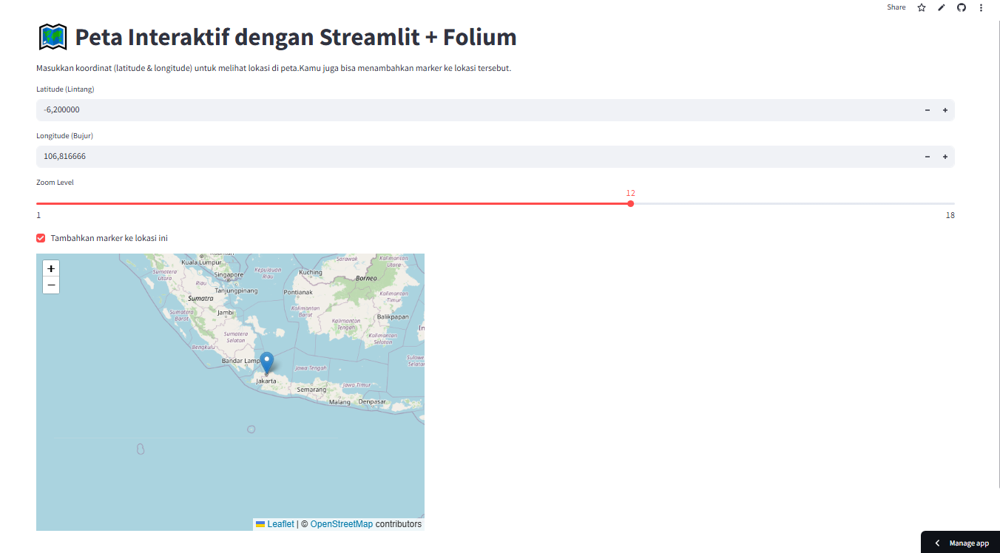

# 🗺️ Streamlit Peta Interaktif

Aplikasi web interaktif berbasis Python untuk menampilkan dan menandai lokasi di peta menggunakan koordinat **latitude** dan **longitude**. Dibuat menggunakan **Streamlit**, **Folium**, dan **streamlit-folium**.

---

## 🌐 Live Demo

🔗 [Klik di sini untuk mencoba aplikasinya](https://idontknowwhatshouldido.streamlit.app/)

---

## ✨ Fitur

- Input koordinat latitude dan longitude
- Kontrol zoom level peta
- Tambahkan marker otomatis ke peta
- Tampilan peta interaktif dengan Folium + Leaflet.js
- UI cepat dan ringan dengan Streamlit

---

## 📸 Cuplikan Tampilan

